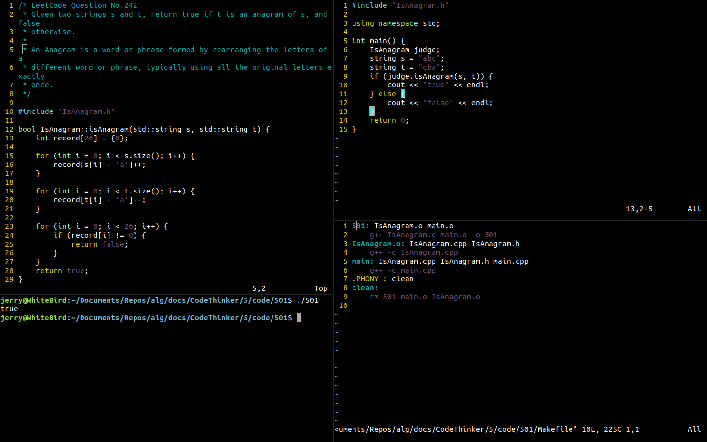

# 2022-08-07 501 有效的字母异位词

> 力扣题目：[Link](https://leetcode.cn/problems/valid-anagram)

### 哈希法开篇

**当我们需要快速判断一个元素是否出现在集合中**的时候，我们就要考虑优先使用哈希法。

### 多文件编译初探

本次题解采用多文件编译链接生成的方式，有利于核心代码与其他代码分离，既可以满足Leetcode格式对算法的专注，还包含了完整运行文件，可以在任意一台计算机上运行。

