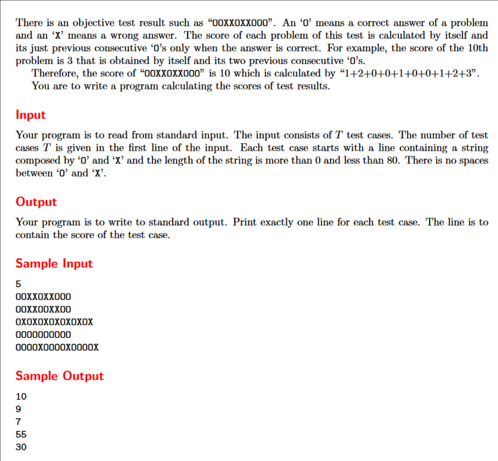

2021-08-03_Uva1585,Score



My problem-thinking idea:


My Answer:

```cpp
#include<iostream>
#include<cstring>
using namespace std;
int main() {

	int n;
	int ctr, score;
	bool tmp_st;
	char s[80];

	scanf("%d",&n);
	while (n--) {
		ctr = 0;
		score = 0;
		tmp_st = false;
		scanf("%s", s);
		for (int i = 0; i < strlen(s); i++) {
			if (tmp_st) {
				if (s[i] == 'X') { tmp_st = false; ctr = 0; }
				if (s[i] == 'O') { ctr = 1; score += ctr; }
			}
			else {
				if (s[i] == 'X') { tmp_st = false; ctr = 0; }
				if (s[i] == 'O') { ctr++; score += ctr; }
			}
		}
		cout << score << endl;
	}


	return 0;
}
```

