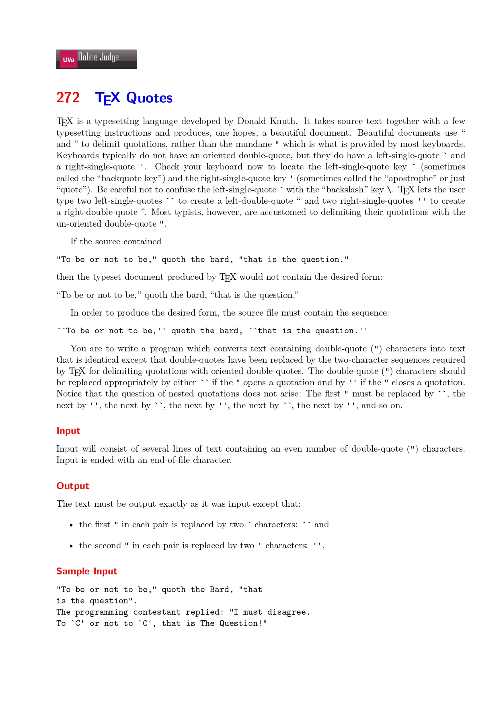
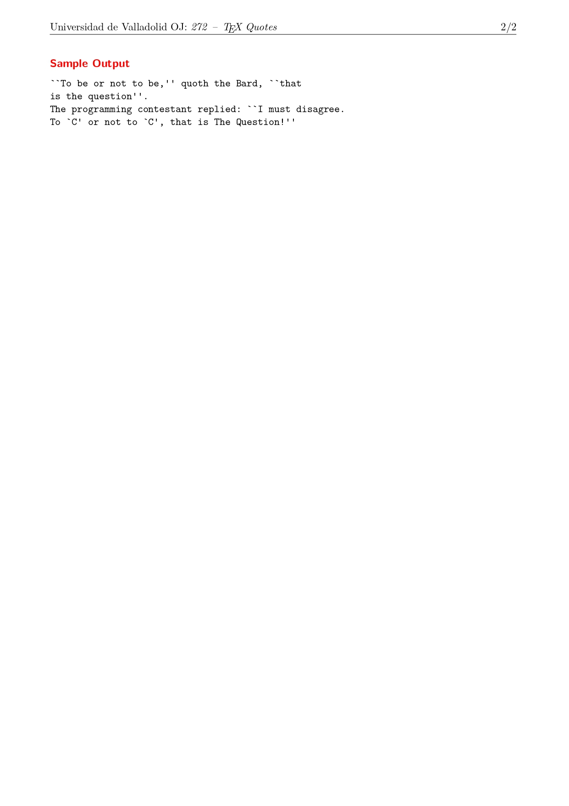

2021-08-04_Uva272,Tex_Quotes





My problem-thinking idea:


My Answer:

```cpp
#include<iostream>
using namespace std;
int main() {
	int c, q = 1;
	while ((c = getchar()) != EOF) {
		if (c == '"') {
			printf("%s", q ? "``" : "''"); 
			q = !q;
		}
		else
		{
			printf("%c", c);
		} 
	}
	return 0;
}
```

