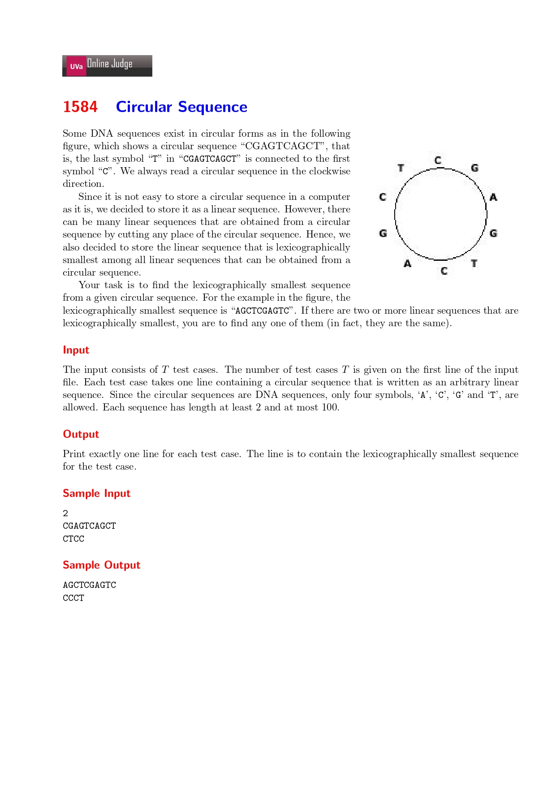

## 2021-08011_Uva1583,Digit_Generator



My Answer:

```cpp
#include <stdio.h>
#include <string.h>
#define maxn 105

int less(const char* s, int p, int q) {
	int n = strlen(s);
	for (int i = 0; i < n; i++) {
		if (s[(p + i) % n] != s[(q + i) % n])
			return s[(p + i) % n] < s[(q + i) % n];
	}
	return 0;
}

int main() {
	int T;
	char s[maxn];
	scanf("%d", &T);
	while (T--) {
		scanf("%s", s);
		int ans = 0;
		int n = strlen(s);
		for (int i = 1; i < n; i++) {
			if (less(s, i, ans)) ans = i;
		}
		for (int i = 0; i < n; i++) {
			putchar(s[(i + ans) % n]);
		}
		putchar('\n');
	}
	return 0;
}
```

My Notes:

There are three points I've learned:

1. The usage of `const`:

    1. if `const` modified `var`, the `var.value()` will not be allowed to change.

        Like this:

        ```c++
        const int i = 5;	//true
        i = 6;		//the val of 'i' can't be changed.
        ```

        

    2. if `const` modified `ptr`, the `ptr.address()` will not be allowed to change.

        Like this:

        ```cpp
        char* const p = &a;		//true
        p = &b;		//the addr of 'p' can't be changed.
        ```

    3. Both usages can use together.

2. If I want to get the length of a string, I can use `strlen()` in `<string.h>` (May be for a long time).

3. In a circulus array, an effective method to traverse it is using `mod() or &`.

