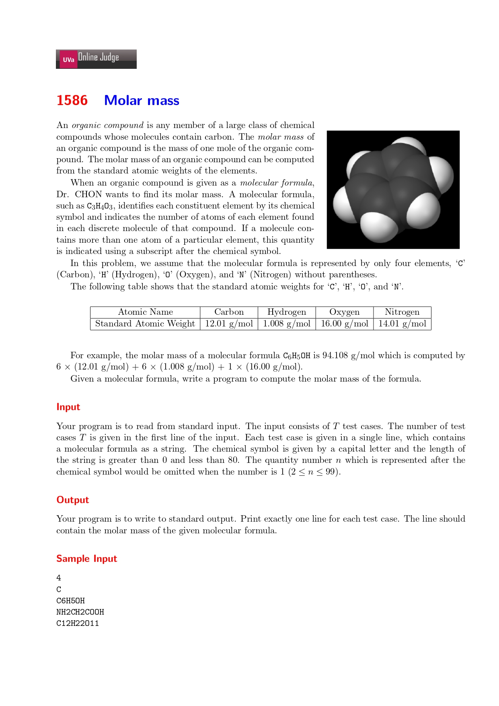
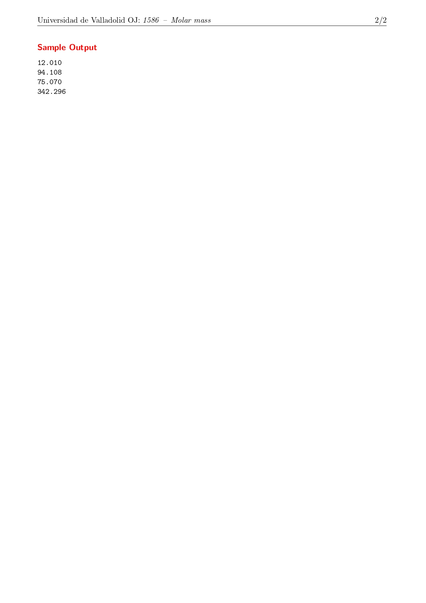

## 2021-08-14_Uva1586,Molar_Mass





My problem-thinking idea:


My Answer:

```cpp

#include <iostream>
#include <cstdlib>
#include <iomanip>
#include <string>

using namespace std;

double scores[200];

int main() {
	
	scores['C'] = 12.01;
	scores['H'] = 1.008;
	scores['O'] = 16.00;
	scores['N'] = 14.01;

	int n;
	int i, j;
	int curNum;
	int len;
	double sum = 0;
	string s;

	cin >> n;

	while (n--) {
		sum = 0;
		cin >> s;
		len = s.length();

		for (i = 0; i < len;) {
			if (!isdigit(s[i])) {
				
				if (i + 1 < len && isdigit(s[i+1])) {
					sum += scores[s[i]];
					i++;
				}
				else if (i + 1 < len && !isdigit(s[i + 1])) {
					for (j = i + 1; j < len && isdigit(s[j]); ++j);
					curNum = stoi(s.substr(i+1, j - (i+1)));
					sum += curNum * scores[s[i]];
					i = j;					
				}
				else {
					sum += scores[s[i]];
					i++;
				}
			}
		}
		cout << fixed << setprecision(3) << sum << endl;
	}
	return 0;
}
```

My Notes:

There are three points I've learned:

1. We should use the `index` of array more flexible, LIKE this:

    ```cpp
    double scores[200];		// Although some memory space is wasted, but it's really make program processing faster~
    ...
    scores['C'] = 12.01;	//Easy to store information~
    ...
    if (i + 1 < len && isdigit(s[i+1])) //Convenient to predict~
    sum += scores[s[i]];	//Easy to locate~
    ```

2. There are 3 functions:

    `isdigit()`: 

    - Intro:

        ```
        int isdigit ( int c );
        ```

        Check if character is decimal digit

        Checks whether *c* is a decimal digit character.

        Decimal digits are any of: `0 1 2 3 4 5 6 7 8 9`

        For a detailed chart on what the different `ctype` functions return for each character of the standard ASCII character set, see the reference for the [`<cctype>`](https://www.cplusplus.com/cctype)header.

        In C++, a locale-specific template version of this function ([isdigit](https://www.cplusplus.com/locale:isdigit)) exists in header [`<locale>`](https://www.cplusplus.com/).

    - Parameters:

        Character to be checked, casted to an int, or EOF.

    - Return Value:

        A value different from zero (i.e., `true`) if indeed *c* is a decimal digit. Zero (i.e., `false`) otherwise.

    - Example:

        ```cpp
        
        /* isdigit example */
        #include <stdio.h>
        #include <stdlib.h>
        #include <ctype.h>
        int main ()
        {
          char str[]="1776ad";
          int year;
          if (isdigit(str[0]))
          {
            year = atoi (str);
            printf ("The year that followed %d was %d.\n",year,year+1);
          }
          return 0;
        }
        
        ```

    `substr()`:

    - Intro:

        ```cpp
        string substr (size_t pos = 0, size_t len = npos) const;
        ```

        Generate substring

        Returns a newly constructed [string](https://www.cplusplus.com/string) object with its value initialized to a copy of a substring of this object.

        The substring is the portion of the object that starts at character position pos and spans len characters (or until the end of the string, whichever comes first).

    - Parameters:

        - pos:

            Position of the first character to be copied as a substring.
            If this is equal to the *[string length](https://www.cplusplus.com/string::length)*, the function returns an empty string.
            If this is greater than the *[string length](https://www.cplusplus.com/string::length)*, it throws [out_of_range](https://www.cplusplus.com/out_of_range).
            Note: The first character is denoted by a value of `0` (not `1`).

        - len:

            Number of characters to include in the substring (if the string is shorter, as many characters as possible are used).
            A value of [string::npos](https://www.cplusplus.com/string::npos) indicates all characters until the end of the string.

    - Return Value:

        A [string](https://www.cplusplus.com/string) object with a substring of this object.

    - Example:

        ```cpp
        // string::substr
        #include <iostream>
        #include <string>
        
        int main ()
        {
          std::string str="We think in generalities, but we live in details.";
                                                   // (quoting Alfred N. Whitehead)
        
          std::string str2 = str.substr (3,5);     // "think"
        
          std::size_t pos = str.find("live");      // position of "live" in str
        
          std::string str3 = str.substr (pos);     // get from "live" to the end
        
          std::cout << str2 << ' ' << str3 << '\n';
        
          return 0;
        }
        ```

    `stoi()`:

    - Intro:

        ```cpp
        int stoi (const string&  str, size_t* idx = 0, int base = 10);
        int stoi (const wstring& str, size_t* idx = 0, int base = 10);
        ```

        Convert string to integer

        Parses *str* interpreting its content as an integral number of the specified *base*, which is returned as an `int` value.

        If *idx* is not a null pointer, the function also sets the value of *idx* to the position of the first character in *str* after the number.

        The function uses [strtol](https://www.cplusplus.com/strtol) (or [wcstol](https://www.cplusplus.com/wcstol)) to perform the conversion (see [strtol](https://www.cplusplus.com/strtol) for more details on the process).

    - Parameters:

        - str

            String object with the representation of an integral number.

        - idx

            Pointer to an object of type [size_t](https://www.cplusplus.com/size_t), whose value is set by the function to position of the next character in *str* after the numerical value. This parameter can also be a null pointer, in which case it is not used.

        - base

            Numerical base (radix) that determines the valid characters and their interpretation. If this is `0`, the base used is determined by the format in the sequence (see [strtol](https://www.cplusplus.com/strtol) for details). Notice that by default this argument is `10`, not `0`.

    - Return Value

        On success, the function returns the converted integral number as an `int` value.

    - Example

        ```cpp
        // stoi example
        #include <iostream>   // std::cout
        #include <string>     // std::string, std::stoi
        
        int main ()
        {
          std::string str_dec = "2001, A Space Odyssey";
          std::string str_hex = "40c3";
          std::string str_bin = "-10010110001";
          std::string str_auto = "0x7f";
        
          std::string::size_type sz;   // alias of size_t
        
          int i_dec = std::stoi (str_dec,&sz);
          int i_hex = std::stoi (str_hex,nullptr,16);
          int i_bin = std::stoi (str_bin,nullptr,2);
          int i_auto = std::stoi (str_auto,nullptr,0);
        
          std::cout << str_dec << ": " << i_dec << " and [" << str_dec.substr(sz) << "]\n";
          std::cout << str_hex << ": " << i_hex << '\n';
          std::cout << str_bin << ": " << i_bin << '\n';
          std::cout << str_auto << ": " << i_auto << '\n';
        
          return 0;
        }
        ```
        - Output:

            ```cpp
            2001, A Space Odyssey: 2001 and [, A Space Odyssey] 40c3:  16579 -10010110001: -1201 0x7f: 127 
            ```

            

