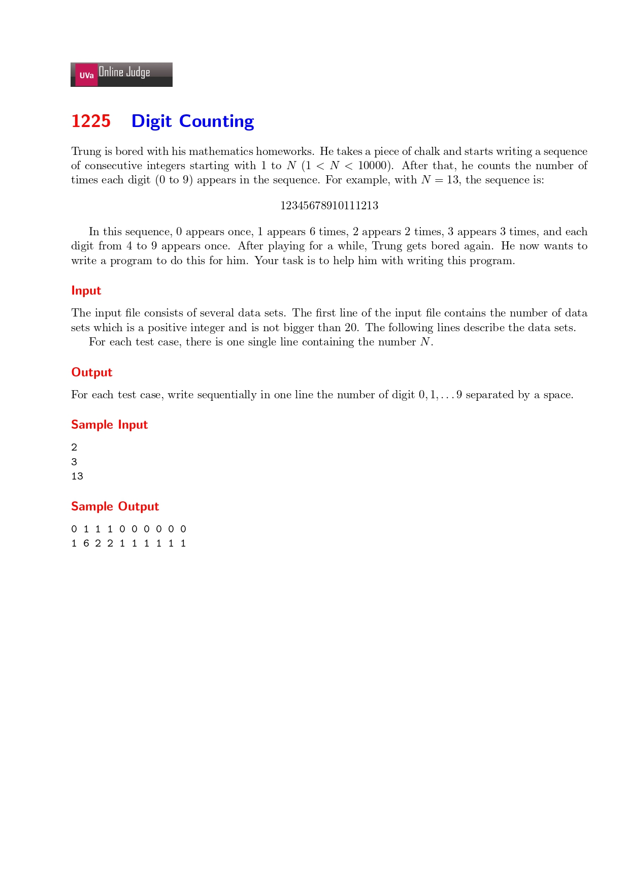

## 2021-08-18_Uva11225,Digit_Counting



My problem-thinking idea:


My Answer:

```cpp
#include <iostream>

using namespace std;

int ctr[20][10] = { 0 };
int main() {
	int N;
	cin >> N;
	int row = N;
	while (N--) {
		int max = 0;
		cin >> max;
		for (int i = 1; i <= max; i++) {
			for (int j = i; j != 0; j /= 10) {
				int tmp = j;
				ctr[N][tmp % 10]++;
			}
		}
	}

	for (int m = row - 1; m >= 0; m--) {
		for (int n = 0; n < 10; n++) {
			if (n < 9)
				cout << ctr[m][n] << " ";
			else
				cout << ctr[m][n];
		}
		if (m > 0) cout << endl; 
	}

	return 0;
}


```

My Notes:

There are few experience to be shared:

1. I can use a fuction `memset()` from `<cstring>` to initialize the two-dimentional array.  

    `memset()`:

    - Intro:

        ```cpp
        void * memset ( void * ptr, int value, size_t num );
        ```

        Fill block of memory

        Sets the first *num* bytes of the block of memory pointed by *ptr* to the specified *value* (interpreted as an `unsigned char`).

    - Parameters

        ptr

        ​	Pointer to the block of memory to fill.

        value

        ​	Value to be set. The value is passed as an `int`, but the function fills the block of memory using the *unsigned char* conversion of this *value*.

        num

        ​	Number of bytes to be set to the *value*.
        [size_t](https://www.cplusplus.com/cstring:size_t) is an unsigned integral type.

    - Return Value

        *ptr* is returned.

    - Example

        ```cpp
        /* memset example */
        #include <stdio.h>
        #include <string.h>
        
        int main ()
        {
          char str[] = "almost every programmer should know memset!";
          memset (str,'-',6);
          puts (str);
          return 0;
        }
        ```

        Output:

        ```txt
         ------ every programmer should know memset! 
        ```

2. I can use `while()` to set the number of cycles;

3. The output part can rewritten by using pointer, like this:

    ```cpp
    void print(int* arr, int row, int col) {
        int row = 0;
        int col = 0;
        for (int i = 0; i < row; i++) {
            for (int j = 0; j < col; j++) {
    				    printf("%d ", arr[(i*row) + j);	
            }
                printf("\n");
        }
    }
    ```

4. Another answer gives me a new idea: use the table-driven method to solve the problem. Of course, this is only feasible when the answer is fixed and finite.

